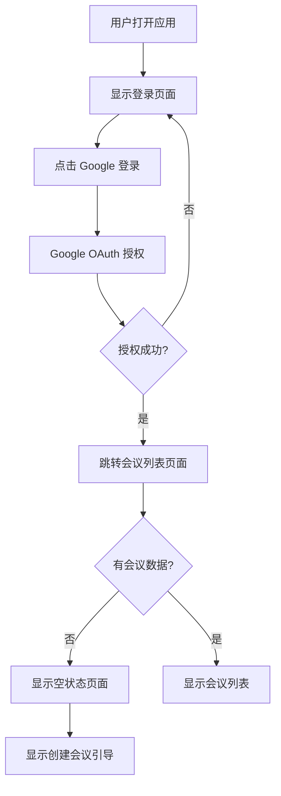

# 视频会议助手 - 产品需求文档

## 1. 产品概述
一个基于 Next.js 14 的视频会议管理平台,提供用户认证和会议列表管理功能,帮助用户高效组织和管理视频会议。

## 2. 核心功能

### 2.1 用户角色
| 角色 | 注册方式 | 核心权限 |
|------|----------|----------|
| 普通用户 | Google OAuth 登录 | 查看会议列表、创建和管理会议 |

### 2.2 功能模块
1. **登录页面**: Google OAuth 授权登录
2. **会议列表页面**: 展示用户的会议列表(空状态设计)

### 2.3 页面详情
| 页面名称 | 模块名称 | 功能描述 |
|----------|----------|----------|
| 登录页面 | Google OAuth 登录 | 用户通过 Google 账号授权登录系统 |
| 会议列表页面 | 空状态展示 | 当用户没有会议时,展示友好的空状态提示和创建会议引导 |
| 会议列表页面 | 导航栏 | 显示用户头像、名称和退出登录功能 |

## 3. 核心流程
用户打开应用后,首先看到登录页面,点击"使用 Google 登录"按钮进行授权。登录成功后,跳转到会议列表页面。如果用户没有创建过会议,显示空状态页面,包含提示信息和"创建会议"按钮。

## 4. 用户界面设计

### 4.1 设计风格
- **主色调**: 深蓝 (#1e3a8a) 作为主色,搭配浅灰 (#f8fafc) 背景
- **按钮样式**: 圆角设计,带轻微阴影效果
- **字体**: 使用 Inter 作为主要字体,标题使用较大字号区分层级
- **布局风格**: 卡片式布局,顶部导航栏
- **图标风格**: 使用 lucide-react 图标库

### 4.2 页面设计概览
| 页面名称 | 模块名称 | UI 元素 |
|----------|----------|----------|
| 登录页面 | 登录卡片 | 居中卡片布局,包含 Google 登录按钮,简洁背景,品牌 Logo |
| 会议列表页面 | 导航栏 | 左侧品牌名称,右侧用户头像和退出按钮 |
| 会议列表页面 | 空状态展示 | 居中图标提示,说明文字,创建会议按钮 |

### 4.3 响应式设计
采用桌面端优先设计,移动端自适应,确保在不同屏幕尺寸下的良好体验。
