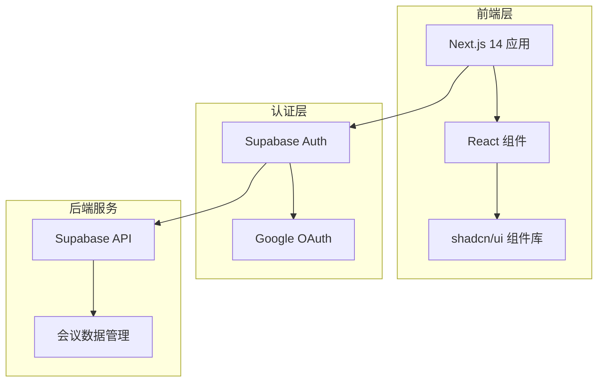
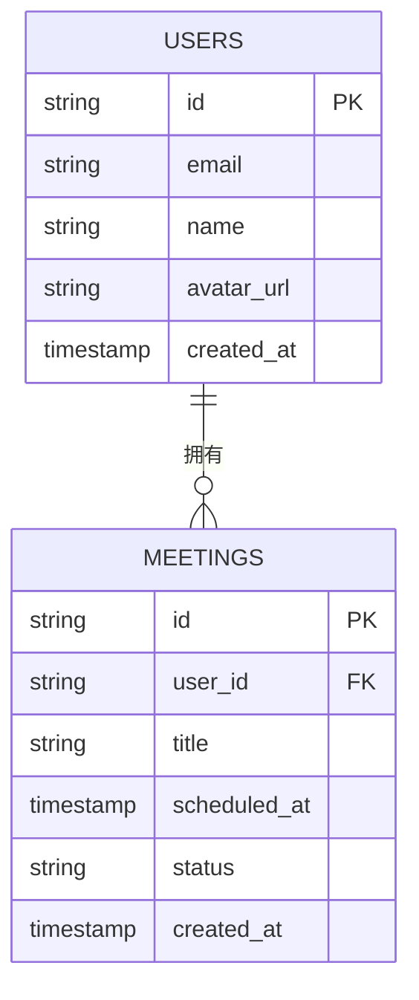

# 视频会议助手 - 技术架构文档

## 1. 架构设计



## 2. 技术说明
- **前端框架**: Next.js 14 + React 18
- **样式框架**: Tailwind CSS
- **组件库**: shadcn/ui (基于 Radix UI)
- **认证服务**: Supabase Auth + Google OAuth Provider
- **数据库**: Supabase PostgreSQL
- **包管理器**: npm (默认)

## 3. 路由定义
| 路由 | 用途 |
|------|------|
| / | 根路由,根据登录状态重定向 |
| /login | 登录页面,提供 Google OAuth 登录 |
| /meetings | 会议列表页面,展示用户的会议 |

## 4. 数据模型

### 4.1 数据模型定义



### 4.2 数据定义语言

```sql
-- 用户表 (由 Supabase Auth 自动管理)
-- meetings 表
CREATE TABLE meetings (
    id UUID PRIMARY KEY DEFAULT gen_random_uuid(),
    user_id UUID REFERENCES auth.users(id) NOT NULL,
    title VARCHAR(255) NOT NULL,
    scheduled_at TIMESTAMP WITH TIME ZONE,
    status VARCHAR(50) DEFAULT 'scheduled',
    created_at TIMESTAMP WITH TIME ZONE DEFAULT NOW()
);

-- 索引
CREATE INDEX idx_meetings_user_id ON meetings(user_id);
CREATE INDEX idx_meetings_scheduled_at ON meetings(scheduled_at);
```

## 5. Supabase 配置

### 5.1 环境变量
- `NEXT_PUBLIC_SUPABASE_URL`: Supabase 项目 URL
- `NEXT_PUBLIC_SUPABASE_ANON_KEY`: Supabase 匿名密钥
- `NEXT_PUBLIC_GOOGLE_CLIENT_ID`: Google OAuth 客户端 ID

### 5.2 Supabase 客户端设置
使用 `@supabase/supabase-js` 创建客户端实例,配置 Google OAuth Provider。
